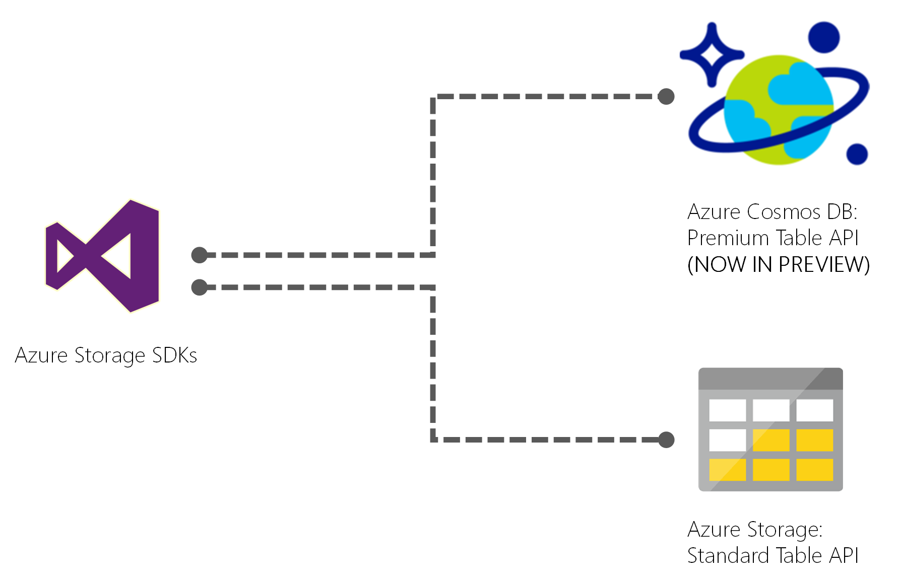

# Getting started with Azure Cosmos DB: Table API
[Azure Cosmos DB](http://cosmosdb.com) is a globally distributed, multi-model database for mission critical applications. Azure Cosmos DB provides the [Table API](https://docs.microsoft.com/azure/cosmosdb/table-introduction.md) for applications that need a key-value store with a schema-less design. Azure Cosmos DB supports throughput-optimized tables (informally called "premium tables"), currently in public preview.

## About this sample: CRUD and Query using the Azure Table storage preview SDK

During the preview, Azure Cosmos DB supports the Table API using the .NET SDK. You can download the [Azure Storage Preview SDK from Nuget](https://www.nuget.org/packages/WindowsAzure.Storage-PremiumTable/0.1.0-preview), that has the same classes and method signatures as the public Azure storage SDK, but also has the ability to connect to Azure Cosmos DB accounts using the Table API.

 

This sample is for developers who are familiar with the Azure Table storage SDK, and would like to use the premium features available using Azure Cosmos DB. It is based on Get Started with Azure Table storage using .NET and shows how to take advantage of additional capabilities like secondary indexes, provisioned throughput, and multi-homing. 

* Open in Visual Studio
* Update the connection string to your Azure Cosmos DB account endpoint and keys, e.g. `<add key="StorageConnectionString" value="DefaultEndpointsProtocol=https;AccountName=account-name;AccountKey=account-key;EndpointSuffix=core.windows.net" />`
* Run the application

We provide a walkthrough of the sample at [Get started with Azure Cosmos DB's Table API using .NET](https://docs.microsoft.com/azure/cosmosdb/create-table-dotnet.md)

## Premium tables overview
If you currently use Azure Table storage, you gain the following benefits with the preview:

* Turn-key global distribution with multi-homing and automatic and manual failvoers
* Support for automatic schema-agnostic indexing against all properties ("secondary indexes"), and fast queries
* Support for independent scaling of storage and throughput, across any number of regions
* Support for dedicated throughput per table that can be scaled from 100s to millions of requests per second
* Support for five tunable consistency levels to trade off availability, latency, and consistency based on your application needs
* 99.99% availability within a single region, and ability to add more regions for higher availability, and industry-leading comprehensive SLAs on general availability
* Work with the existing Azure storage .NET SDK, and no code changes to your application

